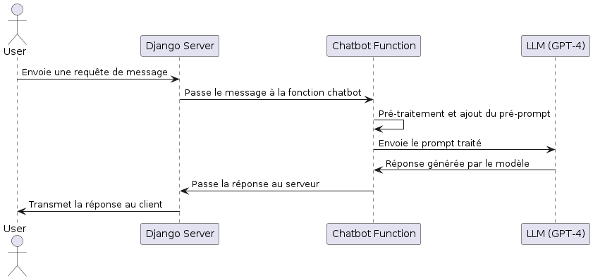

# Suivi de Progression du Projet Django Documentation

## Détails du Projet

- **Nom du projet**: Application de Recherche de Documentation
- **Date de début**: 21 Juin 2024
- **Date de fin prévue**: 24 Juin 2024
- **Technologies utilisées**: Django, sqlite3, Docker, github actions, OpenAI GPT-4 (future) API. 

## Journal de Progression

### 21 juin 2024

- **Tâche**: Configuration initiale du projet, CI/CD et environnement de production
  - **Temps passé**: 4 heures
  - **Utilisation de ChatGPT**: Non
  - **Détails**:
    - Création du projet Django
    - Configuration des paramètres de base
    - Création de l'application `documentation`
    - Configuration de la base de données
    - Configuration de CI/CD (Continuous Integration/Continuous Deployment)
    - Mise en place de l'environnement de production avec Docker
    - Deploiment sur digital ocean

### 22 Juin 2024

- **Tâche**: Développement et intégration des fonctionnalités de base de l'application de documentation
  - **Temps passé**: 5 heures
  - **Utilisation de ChatGPT**: Oui
  - **Détails**:
    - **Modèle de données**:
      - Création du modèle `Document` avec les champs `title`, `content`, `created_at`, et `updated_at`
      - Réalisation des migrations (`makemigrations` et `migrate`)
    - **Vues et Templates**:
      - Création des vues pour la liste des documents (`document_list`) et le détail d'un document (`document_detail`)
      - Création des templates HTML pour afficher la liste et le détail des documents
      - Intégration de Bootstrap et mise à jour des templates pour utiliser les classes Bootstrap
    - **Administration Django**:
      - Enregistrement du modèle `Document` dans l'admin
    - **Tests et Vérifications**:
      - Test de l'ajout de documents via l'interface d'administration
      - Vérification de l'affichage correct des documents dans la liste et le détail
    - **Internationalisation (i18n)**:
      - Configuration pour l'anglais et le français
      - marquage des chaînes pour traduction, génération et compilation des fichiers de traduction, ajout d'un sélecteur de langue.
    - **Documentation**:
      - Rédaction des instructions pour lancer l'application
      - Mise à jour du fichier `README.md` avec les instructions de lancement et les informations de base sur le projet

### 23 Juin 2024

- **Tâche**: Planification et création du chatbot LLM
  - **Temps passé**: 2 heures
  - **Utilisation de ChatGPT**: Oui
  - **Détails**:
    - Création d'un diagramme de séquence PlantUML pour le chatbot interrogeant un LLM
    - Développement de la logique du chatbot
    

  
- **Tâche**: Intégration de la recherche augmentée par intelligence artificielle (RAG)
  - **Temps passé**: 1 heure
  - **Utilisation de ChatGPT**: Oui
  - **Détails**:
    - Création d'un diagramme de séquence PlantUML pour le RAG
    - Développement du traitement pré-prompt pour interroger les LLM avec des informations basées sur le site web

### [Date]

- **Tâche**: Configuration de l'admin Django
  - **Temps passé**: [Temps en heures/minutes]
  - **Utilisation de ChatGPT**: Oui/Non
  - **Détails**:
    - Enregistrement du modèle `Document` dans l'admin

### [Date]

- **Tâche**: Internationalisation (i18n)
  - **Temps passé**: [Temps en heures/minutes]
  - **Utilisation de ChatGPT**: Oui/Non
  - **Détails**:
    - Configuration des paramètres i18n
    - Marquage des chaînes de caractères pour traduction
    - Génération et compilation des fichiers de traduction

## Utilisation de ChatGPT

### Liste des Interactions

- **[Date]**: Assistance pour la création du projet et la configuration initiale.
- **[Date]**: Conseils sur la structure du modèle de données.
- **[Date]**: Aide à la configuration de l'internationalisation.

## Instructions pour Lancer l'Application

### Prérequis

- Python 3.8 ou supérieur
- Django 3.2 ou supérieur
- PostgreSQL (optionnel, peut être remplacé par SQLite pour le développement)
- Git (optionnel)

### Étapes pour Lancer l'Application

1. **Cloner le dépôt** (si applicable) :

    ```sh
    git clone [URL du dépôt]
    cd docsearch
    ```

2. **Créer un environnement virtuel** :

    ```sh
    python -m venv env
    source env/bin/activate  # Pour Windows: env\Scripts\activate
    ```

3. **Installer les dépendances** :

    ```sh
    pip install -r requirements.txt
    ```

4. **Configurer la base de données** :

    - **Option 1: SQLite** (par défaut dans `settings.py`)
    - **Option 2: PostgreSQL** (mettre à jour `settings.py` avec vos informations de base de données)

5. **Appliquer les migrations** :

    ```sh
    python manage.py migrate
    ```

6. **Créer un superutilisateur** :

    ```sh
    python manage.py createsuperuser
    ```

7. **Lancer le serveur de développement** :

    ```sh
    python manage.py runserver
    ```

8. **Accéder à l'application** :

    - Ouvrez votre navigateur et allez à `http://localhost:8000` pour voir l'application.
    - Allez à `http://localhost:8000/admin` pour accéder à l'interface d'administration.
