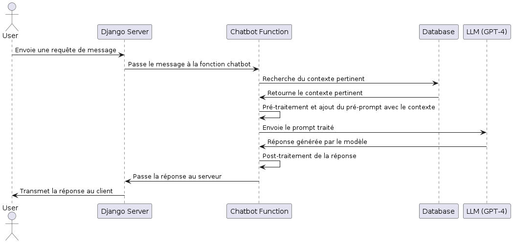

# Suivi de Progression du Projet Django Documentation

## Détails du Projet

- **Nom du projet**: Application de Recherche de Documentation
- **Date de début**: 21 Juin 2024
- **Date de fin prévue**: 24 Juin 2024
- **Technologies utilisées**: Django, sqlite3, Docker, github actions, OpenAI GPT-4 (future) API. 

## Journal de Progression

### 21 juin 2024

- **Tâche**: Configuration initiale du projet, CI/CD et environnement de production
  - **Temps passé**: 4 heures
  - **Utilisation de ChatGPT**: Non
  - **Détails**:
    - Création du projet Django
    - Configuration des paramètres de base
    - Création de l'application `documentation`
    - Configuration de la base de données
    - Configuration de CI/CD (Continuous Integration/Continuous Deployment)
    - Mise en place de l'environnement de production avec Docker
    - Deploiment sur digital ocean

### 22 Juin 2024

- **Tâche**: Développement et intégration des fonctionnalités de base de l'application de documentation
  - **Temps passé**: 5 heures
  - **Utilisation de ChatGPT**: Oui
  - **Détails**:
    - **Modèle de données**:
      - Création du modèle `Document` avec les champs `title`, `content`, `created_at`, et `updated_at`
      - Réalisation des migrations (`makemigrations` et `migrate`)
    - **Vues et Templates**:
      - Création des vues pour la liste des documents (`document_list`) et le détail d'un document (`document_detail`)
      - Création des templates HTML pour afficher la liste et le détail des documents
      - Intégration de Bootstrap et mise à jour des templates pour utiliser les classes Bootstrap
    - **Administration Django**:
      - Enregistrement du modèle `Document` dans l'admin
    - **Tests et Vérifications**:
      - Test de l'ajout de documents via l'interface d'administration
      - Vérification de l'affichage correct des documents dans la liste et le détail
    - **Internationalisation (i18n)**:
      - Configuration pour l'anglais et le français
      - marquage des chaînes pour traduction, génération et compilation des fichiers de traduction, ajout d'un sélecteur de langue.
    - **Documentation**:
      - Rédaction des instructions pour lancer l'application
      - Mise à jour du fichier `README.md` avec les instructions de lancement et les informations de base sur le projet

### 23 Juin 2024

- **Tâche**: Planification et création du chatbot LLM
  - **Temps passé**: 2 heures
  - **Utilisation de ChatGPT**: Oui
  - **Détails**:
    - Création d'un diagramme de séquence PlantUML pour le chatbot interrogeant un LLM
    - Développement de la logique du chatbot  
  
  

- **Tâche**: Intégration de la recherche augmentée par intelligence artificielle (RAG)
  - **Temps passé**: 3 heures
  - **Utilisation de ChatGPT**: Oui
  - **Détails**:
    - Création d'un diagramme de séquence PlantUML pour le RAG
    - Développement du traitement pré-prompt pour interroger les LLM avec des informations basées sur le site web
    - Implémentation de la récupération des documents pertinents depuis la base de données
    - Utilisation de LangChain pour le traitement des documents et l'intégration avec OpenAI
  
  

### 24 Juin 2024
- **Tâche**: Finalisation et tests du chatbot
  - **Temps passé**: 4 heures
  - **Utilisation de ChatGPT**: Oui
  - **Détails**:
    - Test du chatbot avec différents scénarios de questions pour vérifier la pertinence des réponses
    - Ajustement des prompts et des paramètres pour améliorer la qualité des réponses
    - Mise en place de tests unitaires et d'intégration pour le chatbot
    - Déploiement de la version finale de l'application sur Digital Ocean
    - Mise à jour de la documentation pour inclure les dernières modifications et instructions de test

## Utilisation de ChatGPT

### Liste des Interactions

- **21 Juin 2024**: Assistance pour la création du projet et la configuration initiale.
- **22 Juin 2024**: Aide à la configuration de l'internationalisation.
- **23 Juin 2024**: Aide à la planification et à la création du chatbot LLM (ainsi que les templates).
- **24 Juin 2024**: Aide à la finalisation et aux tests du chatbot.

